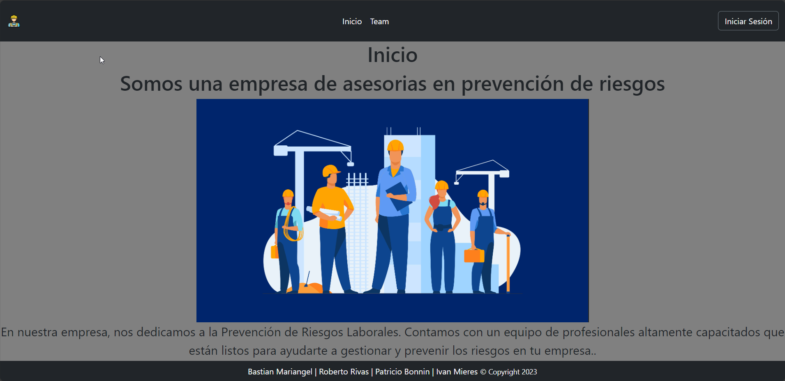
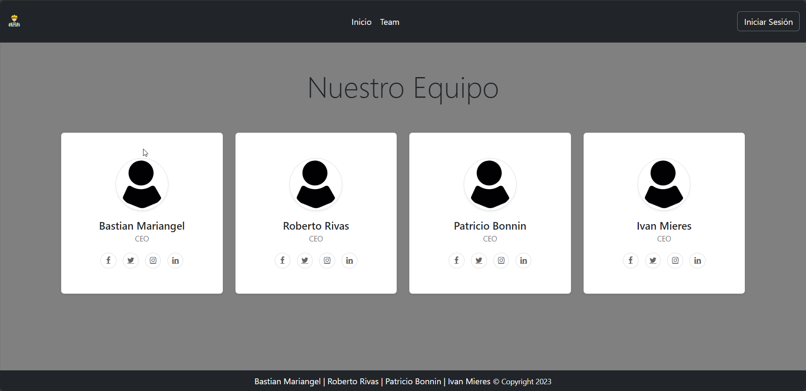
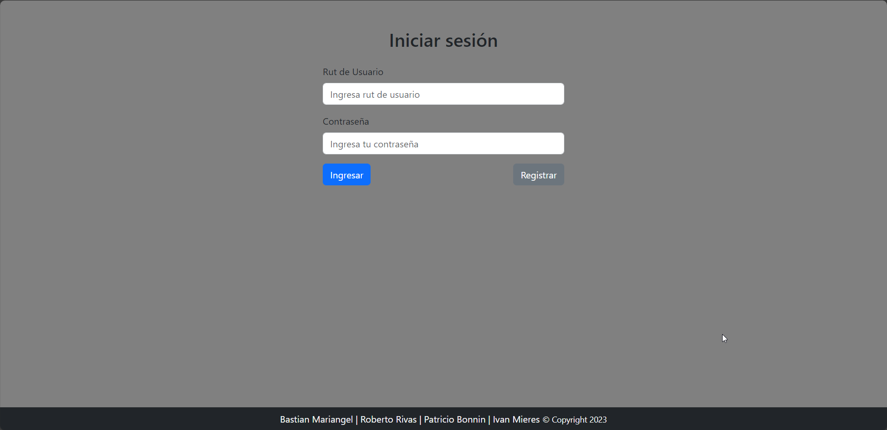
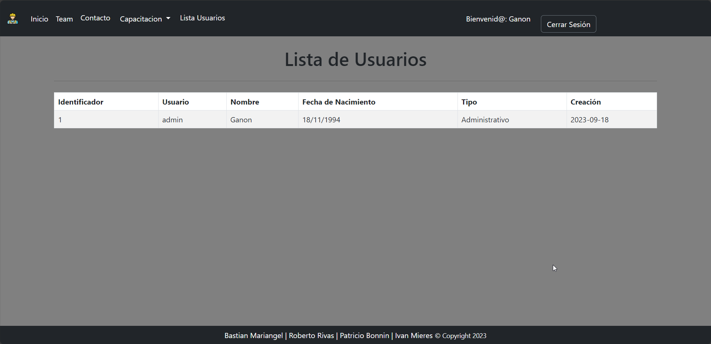
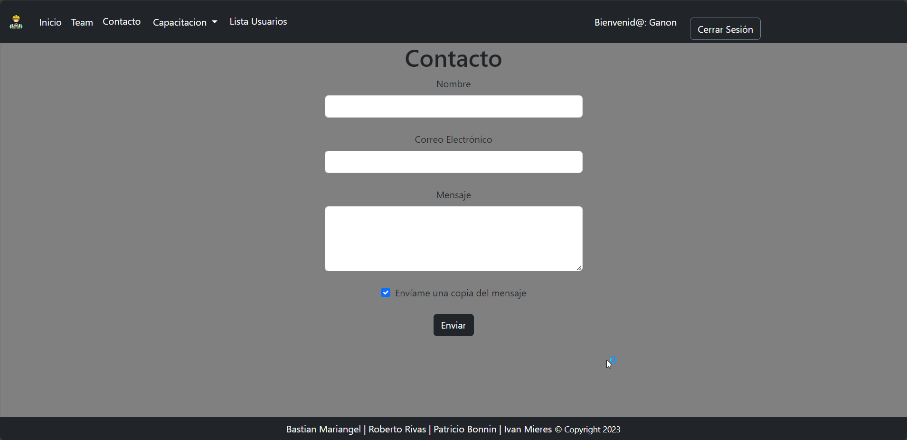
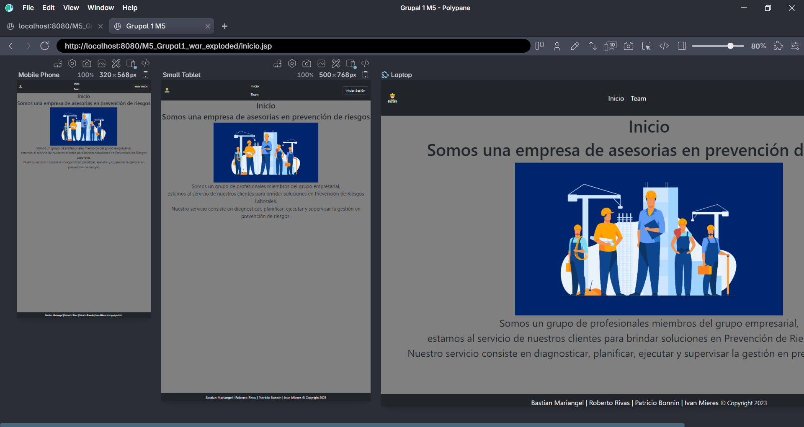

Formulario de contacto para realizar Cliente

|                                                               |                                |                                                                                                                                                                                         |                                        |
|---------------------------------------------------------------|--------------------------------|-----------------------------------------------------------------------------------------------------------------------------------------------------------------------------------------|----------------------------------------|
|                                                               |                                |                                                                                                                                                                                         |                                        |
| 10                                                            | **Listado Visitas**            | Lista de todas las visitas realizadas a cada uno de los clientes. Además, posee un formulario que permite agregar nuevas visitas a sistema.                                             | Profesional                            |
| 11                                                            | **Responder checklist**        | Listado de chequeos de una visita.                                                                                                                                                      | Profesional                            |
| 12                                                            | **Listado Pago**               | Lista de todos los pagos realizados por los clientes.                                                                                                                                   | Administrativo                         |
| 13                                                            | **Crear Pago**                 | Permitirá agregar un pago al sistema.                                                                                                                                                   | Administrativo                         |
| 14                                                            | **Listado Asesorías**          | Lista con las asesorías realizadas hasta el momento.                                                                                                                                    | Profesional                            |
| 15                                                            | **Crear Asesorías**            | Contiene un formulario para agregar una nueva asesoría.                                                                                                                                 | Profesional                            |
| 16                                                            | **Reportes**                   | Despliega reportes específicos.                                                                                                                                                         | Profesional                            |
| 17                                                            | **Administrar** **Asistentes** | Administración de asistentes a una capacitación; incluye listarlos, poder agregar asistentes y eliminarlos.                                                                             | Cliente                                |
| 18                                                            | **Login**                      | Contendrá un acceso a un usuario al portal a través de un RUT de usuario y una clave.                                                                                                   | Cliente / Administrativo / Profesional |
| 19                                                            | **Gestionar accidentes**       | Listado con todos los accidentes registrados en plataforma. Además, permite editarlos, agregar uno nuevo y eliminarlos. En esta sección cada cliente administra sus propios accidentes. | Cliente                                |
| 20                                                            | **Administrar chequeos**       | Permite mostrar los distintos chequeos realizados a cada cliente en una visita a terreno, y permite agregar uno nuevo, y cambiar su estado.                                             | Administrativo                         |
|                                                               |                                |                                                                                                                                                                                         |                                        |

| En los ejercicios de las sesiones anteriores, se crearon servlets para los siguientes casos de uso:  • Inicio • Contacto • Crear Capacitación • Listar Capacitación • Login • Listado de Usuarios • Crear Usuario    1. Cargue el script para la base de datos que se adjunta en el ejercicicio. 2. Cree un paquete de nombre “conexion”. 3. En el paquete creado en el punto anterior, agregue una clase con un método que permita retornar una conexión a la base de datos antes mencionada por medio del patrón Singleton. 4. Modifique el comportamiento de los métodos de implementación de la clase Capacitacion. Debe lograr que la plataforma permita desplegar el listado de capacitaciones registrado En la base de datos, y que al mismo tiempo permita registrar un nuevo registro en la base de datos. 5. En el caso del formulario de creación de una nueva capacitación, los datos se deben validar por medio de Javascript o jQuery. Aplique las validaciones indicadas en ejercicios de módulos anteriores relacionadas con este caso de uso.   El entregable debe ser un proyecto web dinámico Java comprimido en formato RAR o ZIP.   **Nota 1:** Este ejercicio es la continuación del ejercicio grupal del día anterior.   **Nota 2:** Considere que, en el modelo de datos generado en ejercicios anteriores, existen reglas de integridad referencial que obligan a que una capacitación se asocie a un cliente existente en la base de datos. Desactive temporalmente esta llave foránea, a fin de que no se generen inconvenientes. |
|--------------------------------------------------------------------------------------------------------------------------------------------------------------------------------------------------------------------------------------------------------------------------------------------------------------------------------------------------------------------------------------------------------------------------------------------------------------------------------------------------------------------------------------------------------------------------------------------------------------------------------------------------------------------------------------------------------------------------------------------------------------------------------------------------------------------------------------------------------------------------------------------------------------------------------------------------------------------------------------------------------------------------------------------------------------------------------------------------------------------------------------------------------------------------------------------------------------------------------------------------------------------------------------------------------------------------------------------------------------------------------------------------------------------------------------------------------------------------------------------------------------------------------------------------------------|
| El Datos de apoyo al planteamiento                                                                                                                                                                                                                                                                                                                                                                                                                                                                                                                                                                                                                                                                                                                                                                                                                                                                                                                                                                                                                                                                                                                                                                                                                                                                                                                                                                                                                                                                                                                           |
| **Ejecución**: Grupal (equipo de no más 4 personas)   **Componentes para evaluar**: Se deberá entregar un proyecto Java web dinámico, comprimido en formato ZIP o RAR.                                                                                                                                                                                                                                                                                                                                                                                                                                                                                                                                                                                                                                                                                                                                                                                                                                                                                                                                                                                                                                                                                                                                                                                                                                                                                                                                                                                       |
|                                                                                                                                                                                                                                                                                                                                                                                                                                                                                                                                                                                                                                                                                                                                                                                                                                                                                                                                                                                                                                                                                                                                                                                                                                                                                                                                                                                                                                                                                                                                                              |
| Recursos Bibliográficos:                                                                                                                                                                                                                                                                                                                                                                                                                                                                                                                                                                                                                                                                                                                                                                                                                                                                                                                                                                                                                                                                                                                                                                                                                                                                                                                                                                                                                                                                                                                                     |
|   **Qué es Java Enterprise (J2ee, JEE)** https://www.fundesem.es/bt/publicacion-java-ee-y-el-desarrollo-web-un-enfoque-de-aprendizaje  **Qué son los Servlets** https://users.dcc.uchile.cl/\~jbarrios/servlets/general.html  **Utilizando métodos post y get** https://www.ecodeup.com/enviar-parametros-servlet-desde-una-vist a-utilizando-post-get/  **Sesiones y cookies** https://ricardogeek.com/manejo-de-sesiones-y-cookies-en-servlets-java/  **Etiquetas JSTL** http://www.jtech.ua.es/ayto/ayto2008/jsp/sesion07-apuntes.html   **MVC**https://www.ecodeup.com/patrones-de-diseno-en-java-mvc-dao-y-dto/   **Introducción a MVC con Servlets y JSP** http://blog.oscarscode.com/es/java-es/introduccion-a-mvc-con-servlets-y-jsp/   **Patrón Singleton** <https://reactiveprogramming.io/blog/es/patrones-de-diseno/singleton>   

**Ejercicio Grupal 4 Modulo 5**

## **Integrantes :**
<table>
  <tr>
    <td></td>
    <td></td>
    <td></td>
    <td></td>
    <td></td>

  </tr>
</table>

